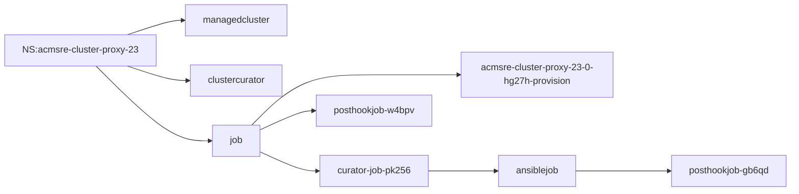

# Ansible

## ansible collection stolostron.core

If you have deployed Ansible Automation Platform in a cluster, you can setup an ansible dynamic inventory of all the managed clusters managed by ACM/MCE.

Starting in RHACM 2.5, we added support for cluster-proxy and managed-serviceaccount capabilities in ACM/MCE on the hub and managed cluster side.
When enabled, the ACM/MCE hub acts as a connection proxy to all the managed clusters, and AAP can manage those clusters through the ACM/MCE.

### How this works

1. Add a kubeconfig credential to AAP to allow access to the cluster-proxy route on the ACM/MCE hub.
2. Setup the stolostron.core collection (client side code) on the AAP cluster. The ansible playbooks will use this module to connect to the ACM/MCE hub cluster, and handshake with the managed cluster. Exposeing the managed clusters to the anisible playbook.

You can run this playbook to setup dyanmic inventory of all the OCM/ACM/MCE managed clusters.
The ansible-collection.core is provided through an exeuction engine docker container.

```bash
ansible-playbook playbooks/aap-controller-ocm-collection-setup.yml -e tenant=playback
```

## Use the dynamic inventory to manage new provisioned clusters with Ansible post-install webhook

We have enabled integration across the 3 pillars in ACM--cluster lifecycle, policy, and application. Initially, the focus was to allow manaaging exsternal systems based on steps in the three pillars. There was no way to run playbooks against cluster that was just provisioned automaticially, end to end. Manual intervention was always required.

With dyanmic inventory and the cluster-proxy we can achieve this. 

1. Create an ansible job template, to perform some management task on a new managed cluster.
2. Create the corresponding job template automation reference in RHACM.
3. When the cluster is provisioned, it will be imported into RHACM automatically.
4. The post-install job template will trigger
4.1 The job template will sync the inventory to include the new managed cluster
4.2 The ansible job will be run, and include the extra_vars variable ansible_limit=<managed cluster name>
4.3 The job template should run against ansible host in question.

### Connecting the dots

When we create a cluster with an ansible post install job through the CONSOLE, these are the related CR.



* If we want to run a playbook against a specific managed cluster, the playback has to be written where the inventory host needs to be passed as a variable to the playbook.
* When ACM clustercurator creates the ansiblejob CR, it does not pass `--limit` variable. It is only aware of `extra_vars` variable list.


# Explicitly enable the managed-serviceaccount addon

The managed-serviceaccount addon needs to be explicitly enabled on a given managed cluster. 

* Therefore, in the usecase where customers want to in ansible jobs on newly created or imported clusters, the ansible playbook running against the new cluster should include this task. 

Here, I include the manifest need to manually enable this feature on the managed cluster.

```bash
oc apply -f - <<EOF
apiVersion: addon.open-cluster-management.io/v1alpha1
kind: ManagedClusterAddOn
metadata:
  name: managed-serviceaccount
  namespace: kind-cdoan-aap-integration-test-1
spec:
  installNamespace: open-cluster-management-agent-addon
EOF
```

## Cluster Life Cycle - post install ansible job

The extra variables passed to ansible job from clustercurator will look like this. The key metadata is the `"{{ cluster_deployment.clusterName }}"`

```json
{
  "cluster_deployment": {
    "baseDomain": "stolostron.io",
    "clusterMetadata": {
      "adminKubeconfigSecretRef": {
        "name": "acmsre-proxy-test-2-0-8pwgn-admin-kubeconfig"
      },
      "adminPasswordSecretRef": {
        "name": "acmsre-proxy-test-2-0-8pwgn-admin-password"
      },
      "clusterID": "2e4acf34-39d5-4835-bafe-e4d0f132c284",
      "infraID": "acmsre-proxy-test-2-dzv2d"
    },
    "clusterName": "acmsre-proxy-test-2",
    "controlPlaneConfig": {
      "servingCertificates": {}
    },
    "installAttemptsLimit": 1,
    "installed": true,
    "platform": {
      "aws": {
        "credentialsSecretRef": {
          "name": "acmsre-proxy-test-2-aws-creds"
        },
        "region": "us-east-1"
      }
    },
    ...
  }
}
```
